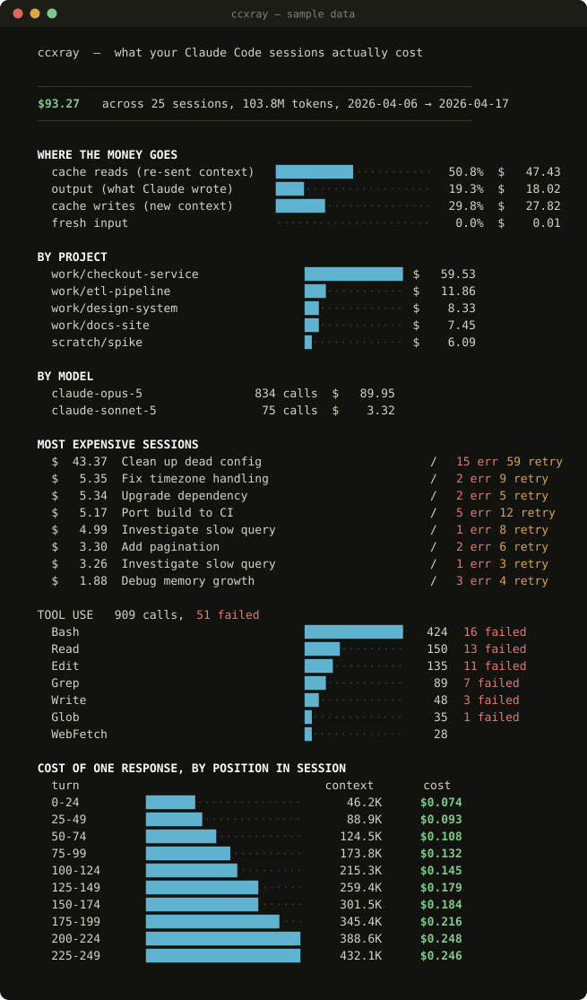

# ccxray

**An X-ray of your Claude Code usage.** One file, no dependencies, nothing leaves your machine.

Claude Code already writes a full transcript of every session to `~/.claude/projects`.
`ccxray` reads those transcripts and tells you what they actually cost, where the money
went, and how much of it was burned on rework.

```bash
curl -O https://raw.githubusercontent.com/OWNER/ccxray/main/ccxray.py
python3 ccxray.py
```

No install, no signup, no API key, no network calls.



> The report above is generated from the **synthetic sample data** bundled with this
> repo, not from anyone's real sessions. Run `python3 make_sample.py sample/` to
> produce it yourself.

---

## What it measures

**Where the money actually goes.** Claude Code has no memory between API calls, so
every turn re-sends the whole conversation. Prompt caching makes repeated context
cheap — a tenth of the normal input rate — but it is still charged on every turn.
The result is that most spend is usually *re-read context*, not generated output.
`ccxray` prices those separately so you can see the split instead of guessing.

**How cost grows with session length.** Because each turn carries everything before
it, the cost of turn *N* scales with *N*, and a whole session scales with *N²*.
`ccxray` buckets every response by its position in its session and shows the curve:

```
  COST OF ONE RESPONSE, BY POSITION IN SESSION
    turn                                   context       cost
    0-24         █████·················      27.9K     $0.041
    75-99        ██████████████········     143.7K     $0.106
    150-174      ████████████████████··     259.4K     $0.150
```

If your later buckets are much taller than your early ones, long sessions are
costing you — and the fix is to finish a task and start a fresh session, not to
tune anything.

**Rework.** Tool calls that came back as errors, and commands retried after already
being tried in the same session. Every failure is a round trip you paid for and got
nothing from, and it stays in the context being re-read for the rest of the session.

## The duplicate-record problem

Claude Code copies earlier turns into a new file whenever a session is resumed or
branched, so the same API response can appear in several `.jsonl` files. Summing
them naively can substantially overstate your bill.

`ccxray` deduplicates on the API message ID, counts each response once, and reports
how much it skipped:

```
  N duplicated records skipped
     Resumed sessions copy earlier turns into new files. Counting them
     naively would have overstated your bill by $X (Y%).
```

The effect is large enough on real histories to be worth checking. If a usage tool
has never mentioned deduplication, check its arithmetic.

## Usage

```bash
python3 ccxray.py                      # terminal report
python3 ccxray.py --html report.html   # standalone HTML report
python3 ccxray.py --json               # machine-readable, pipe it anywhere
python3 ccxray.py --anonymize          # placeholder names, safe to share
python3 ccxray.py --dir ./transcripts  # somewhere other than ~/.claude/projects
```

### Try it without your own data

```bash
python3 make_sample.py sample/
python3 ccxray.py --dir sample/
```

Generates a set of synthetic transcripts so you can see the report before pointing
it at anything real.

### Sharing a report

`--anonymize` replaces project names, session titles and file paths with
`project-1`, `session-2`, `file-3`, and masks MCP tool names — those embed the
server name, which says what you work on. Built-in tool names are kept, since they
identify nothing and are the useful part of the report. Numbers are untouched.

Use it before you post a screenshot. Your repo names are in those transcripts.

## A note on the numbers

These are **list API prices**, which is the honest way to value the tokens
regardless of how you pay. On a Pro or Max subscription you are not billed this —
the figure is what the same work would cost through the API, which is the only
stable yardstick for "is this session expensive?"

Pricing is Anthropic's published per-million-token rate, with cache reads at 0.1×
input (0.025× on Claude Fable 5.1), cache writes at 1.25× for the 5-minute TTL and
2× for the 1-hour TTL. Unknown models fall back to Opus-tier pricing. The table
lives at the top of `ccxray.py` — edit it if it drifts.

Note that Claude Code chooses the cache TTL, not you. The 1-hour/5-minute split is
a number to understand, not a setting to change.

## Privacy

`ccxray` opens files under `~/.claude/projects`, reads them, and prints. It makes
no network calls of any kind. There is no telemetry, no account, and no upload.
It is one readable Python file — read it before you run it, which you should do
with anything that touches your transcripts.

## Tests

```bash
python3 -m unittest discover -v
```

Stdlib only. They cover the pricing arithmetic, the deduplication (including that
the same message ID across two files is counted once), malformed input, the cost
curve, and that `--anonymize` removes names without touching numbers.

## Requirements

Python 3.8+. That's the whole list.

## License

MIT
